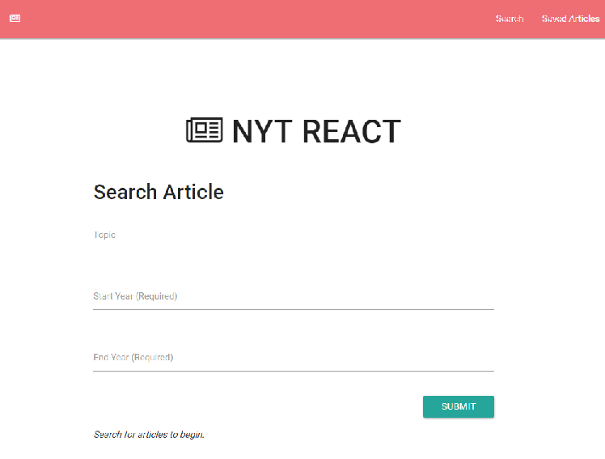
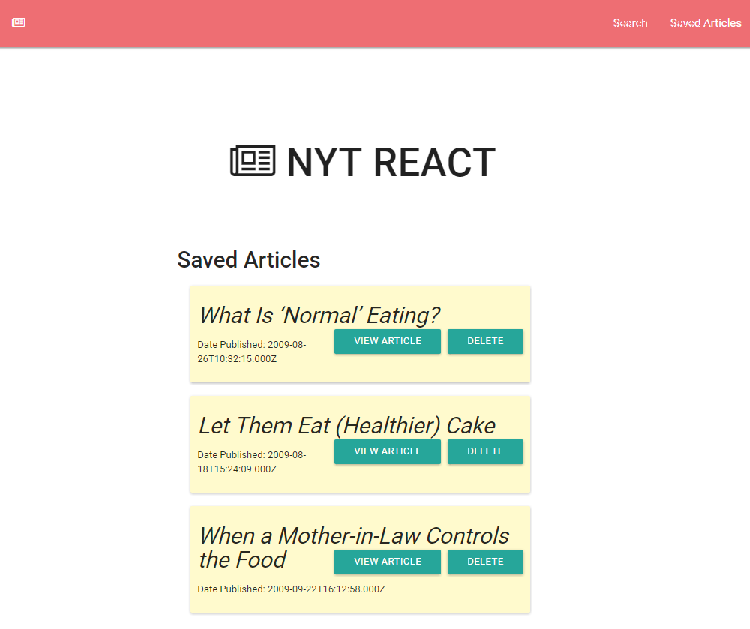

# NYT_React_Search

### Overview

This project is a React-based application that utilizes the React mounting lifecycle to query and display articles based on user searches. Users can also save articles and can be found in the save tab.

### Instructions
1. Users can input Topic, start year, and end year to search for articles from the NYT API. 

2. Users can also save articles and re-read them in the "Saved Article" Section.

### Technologies Used
- HTML
- CSS
- JavaScript
- Node.js
- MongoDB
- mLab
- Heroku

### Frameworks and Packages
- ReactJS
- Express.js
- jQuery
- Mongoose
- Body-Parser
- Morgan

### **[Demo](https://polar-ridge-12020.herokuapp.com/)**